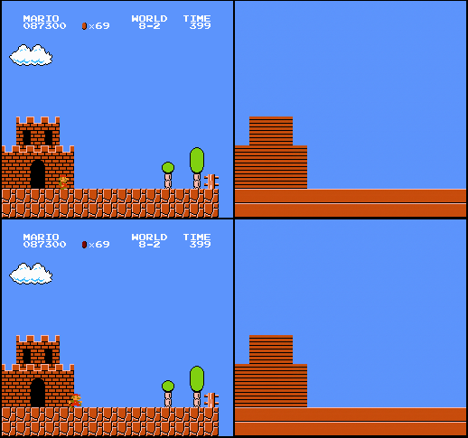
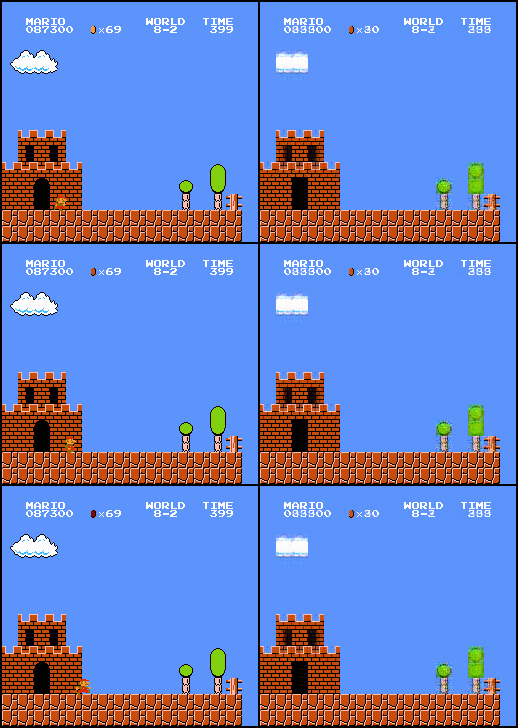
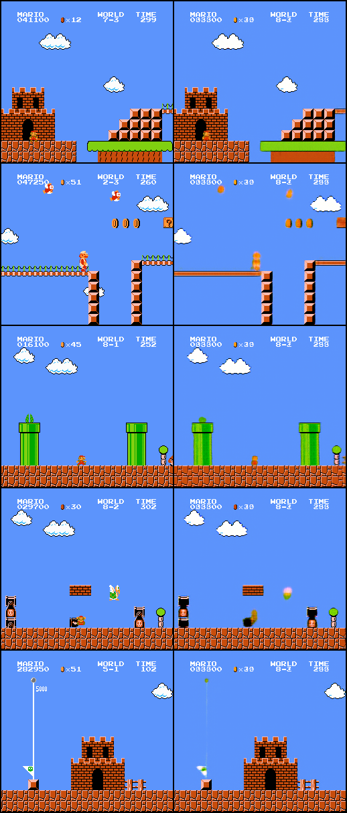

<div align="center"> 

# tinyWM
</div>

tinyWM is a WIP small JEPA style world model (following [LeWorldModel](https://arxiv.org/abs/2603.19312)) for NES SuperMarioBros. The model sees short windows of RGB frames and controller actions, encodes the visual state with a compact ViT, and trains a dynamics predictor to forecast the future latent states.

The preliminary dataset is [rafaelcp/smbdataset](https://github.com/rafaelcp/smbdataset). This project is purely for educational reasons, I do not want to upset the Nintendo Ninjas in any way :p

## Repository Structure

- `dataset.py`: PyTorch dataset for SMB H5 files. It creates fixed length temporal windows inside the episode boundaries and returns `(T, 3, H, W)` frames along with `(T,)` action classes.
- `model.py`: ViT encoder, AdaLN conditioned dynamics predictor, and the `TinyWorldModel` wrapper.
- `train_wm.py`: simple training loop with bf16 autocast, validation, checkpointing, and W&B logging.
- `scripts/create_smb_h5.py`: builds the H5 files from frame images.
- `configs/wm_A100.yaml`: current A100 training config.

## Dataset Format

The H5 file contain:

- `frames`: `uint8`, shape `(N, H, W, 3)`, RGB frames.
- `actions`: `uint8`, shape `(N,)`, action class in `[0, 15]`.
- `episode_offsets`: episode boundaries used to prevent train/val or sample window leakage across episodes.

For training, the H5 should be chunked by temporal fullframe windows. The current dataset reads windows like:

```python
frames[start:end]  # (T, H, W, 3)
```

So optimized H5 files should use chunks like

```text
(16, H, W, 3)
```

Chunk size matters a lot. Bad chunk sizes can lead to unbelievably slow I/O operations.

## Current Status

Experimenting with different decoder architectures for predicting future RGB frames from the latent state. The learned world model is kept frozen, and only the decoder is trained on top of the predicted future latents.

- As expected, reconstructing an image from only the latent state is very difficult. The latent state is a compressed representation of the world that captures how things operate in it, but a decoder predicting pixel perfect frames from only that state is hard to train.

<div align="center">
Target Image (left) | Predicted Image (right)



</div>

- Feeding the decoder the visual patch embeddings from the ViT encoder of the previous frame, in addition to the latent state helps the decoder use information from both the state and the patches. However, the decoder optimize the loss by ignoring dynamic objects entirely. Anything that moves (Mario, enemies, or projectiles) gets ignored.

<div align="center">


</div>

- Warming up the decoder by letting it cheat and see the true current state for the first few iterations, instead of the predicted state, forces it to not ignore the latent. This does help it predict something about moving objects, but it is still a hacky and cheat solution. Need a better way to penalize the decoder for ignoring or blurring out moving objects. A masked loss that focusses on the moving regions might help.

<div align="center">


</div>

## References

[LeWorldModel](https://arxiv.org/abs/2603.19312)

[LeJEPA](https://arxiv.org/abs/2511.08544)

[AdaLN-zero](https://arxiv.org/abs/2212.09748)